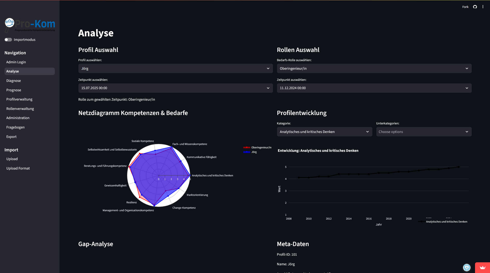

# Kompetenzmanagement App

A **Streamlit application** for analyzing, capturing, and managing team competencies.
The tool helps teams document skills, identify gaps, and generate diagnostic tables. This enables managers to create effective improvement plans.
With a user-friendly API, the app can be easily accessed and used by everyone.


## 📗 Table of Contents
* [Technologies Used](#technologie)
* [Features](#features)
* [Screenshots](#screenshots)
* [Installation](#Installation)
* [Project Status](#project-status)
* [Contact](#contact)


## 📚 Technologie
### Projekt wurde mithilfe von diesen Bibliothek erstellt:


* [![Streamlit][Streamlit.io]][Streamlit-url]
* [![Pandas][Pandas.pydata]][Pandas-url]
* [![NumPy][Numpy.org]][Numpy-url]
* [![pytz][Pytz.org]][Pytz-url]
* [![Plotly][Plotly.com]][Plotly-url]
* [![st-gsheets-connection][Gsheets-Conn]][Gsheets-Conn-url]
* [![streamlit_gsheets][Streamlit-Gsheets]][Streamlit-Gsheets-url]

[Streamlit.io]: https://img.shields.io/badge/Streamlit-FF4B4B?style=for-the-badge&logo=streamlit&logoColor=white
[Streamlit-url]: https://streamlit.io/

[Pandas.pydata]: https://img.shields.io/badge/Pandas-150458?style=for-the-badge&logo=pandas&logoColor=white
[Pandas-url]: https://pandas.pydata.org/

[Numpy.org]: https://img.shields.io/badge/NumPy-013243?style=for-the-badge&logo=numpy&logoColor=white
[Numpy-url]: https://numpy.org/

[Pytz.org]: https://img.shields.io/badge/pytz-003B57?style=for-the-badge
[Pytz-url]: https://pypi.org/project/pytz/

[Plotly.com]: https://img.shields.io/badge/Plotly-3F4F75?style=for-the-badge&logo=plotly&logoColor=white
[Plotly-url]: https://plotly.com/

[Gsheets-Conn]: https://img.shields.io/badge/st--gsheets--connection-0A66C2?style=for-the-badge
[Gsheets-Conn-url]: https://github.com/streamlit/gsheets-connection

[Streamlit-Gsheets]: https://img.shields.io/badge/streamlit__gsheets-0A66C2?style=for-the-badge
[Streamlit-Gsheets-url]: https://github.com/arnaudmiribel/streamlit-gsheets

--

- streamlit == 1.48.0
- pandas==2.3.1
- numpy==2.3.1
- pytz==2025.2
- plotly==6.2.0
- st-gsheets-connection==0.1.0
- scikit-learn==1.7.1
- streamlit_gsheets==0.1.3 hier muss ein githublink rein


---

## ⚙️ Installation
1. Clone the Repo
   ```sh
   git clone https://github.com/TimsGitH/Kompetenzmanagement
   ```

1. Install the requirements

   ```
   $ pip install -r requirements.txt
   ```

2. Run the app

   ```
   $ streamlit run analyse_app.py

   or navigate to testrun.py and click on "Run Python File"
   ```


## 📘 Features

### Analyse
Compare individual competence profiles with organizational needs. Profile development over time is visualized for a clear and intuitive analysis.

### Diagnose
Track and compare the development of roles and their required skills. A correlation table is generated to ensure transparency and traceability.

### Prognose
Predict the future development of competence requirements and individual profiles. Improvement measures can be freely selected to support targeted skill development.

## Screenshots


## Project Status
The project is currently in a prototype stage, but it is actively maintained and supported.  
We are also open to developing it further based on your individual requirements.

## ☎️ Contact

Your Name - [@your_twitter](https://twitter.com/your_username) - email@example.com

Project Link: [https://github.com/TimsGitH/Kompetenzmanagement](https://github.com/TimsGitH/Kompetenzmanagement)